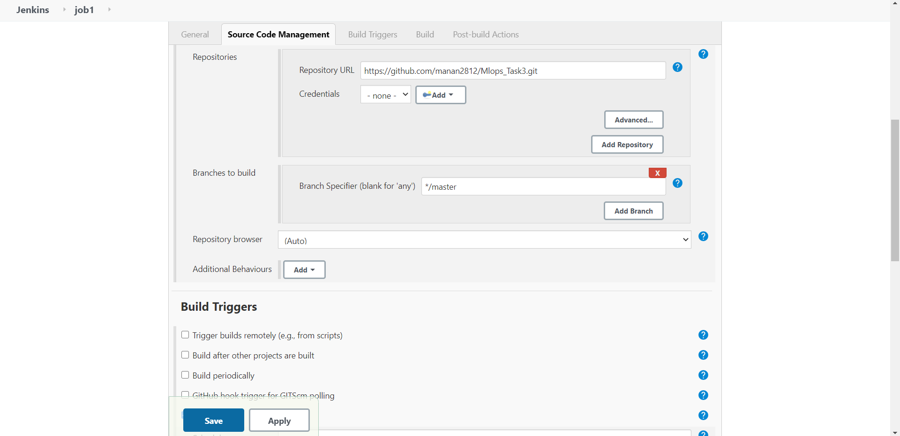
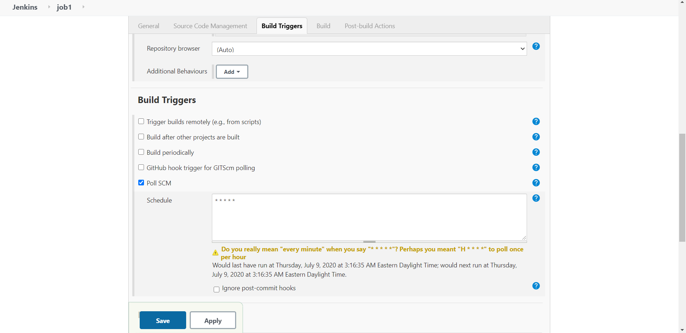
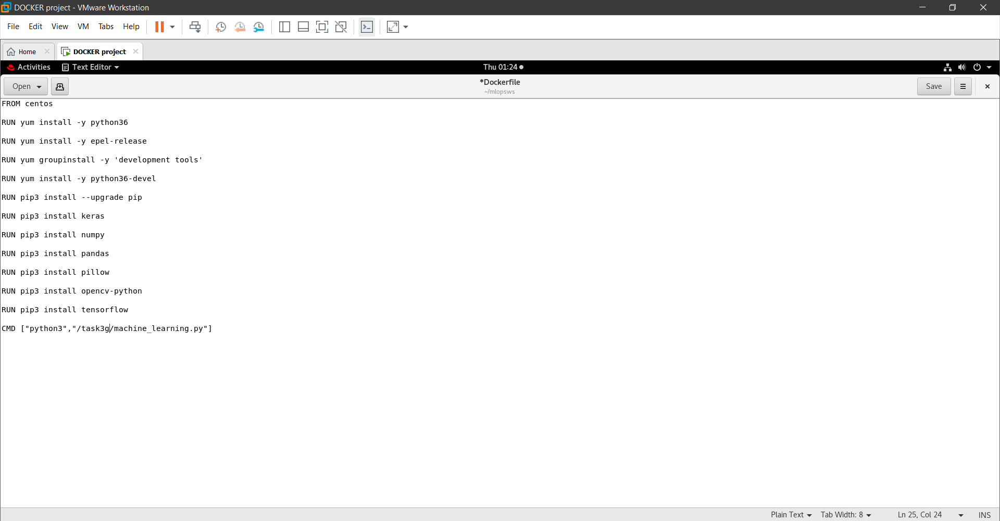
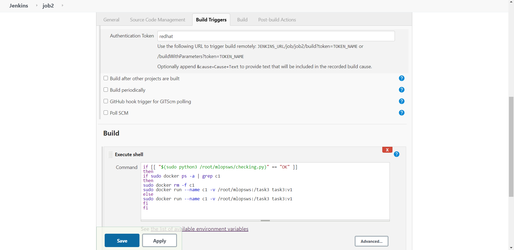
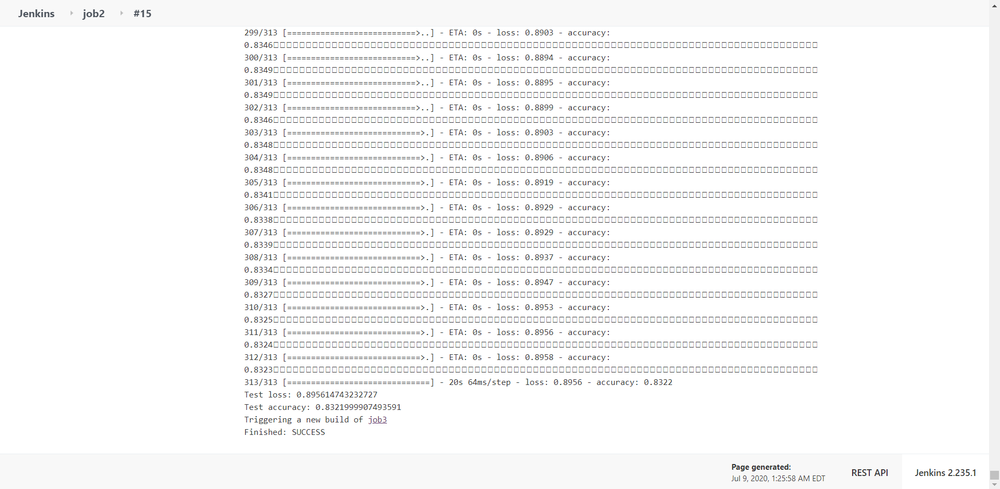
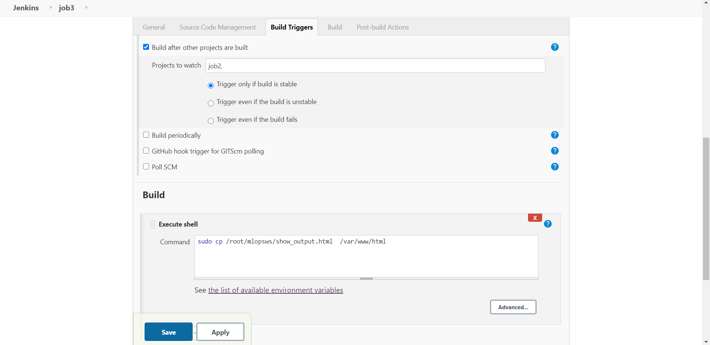
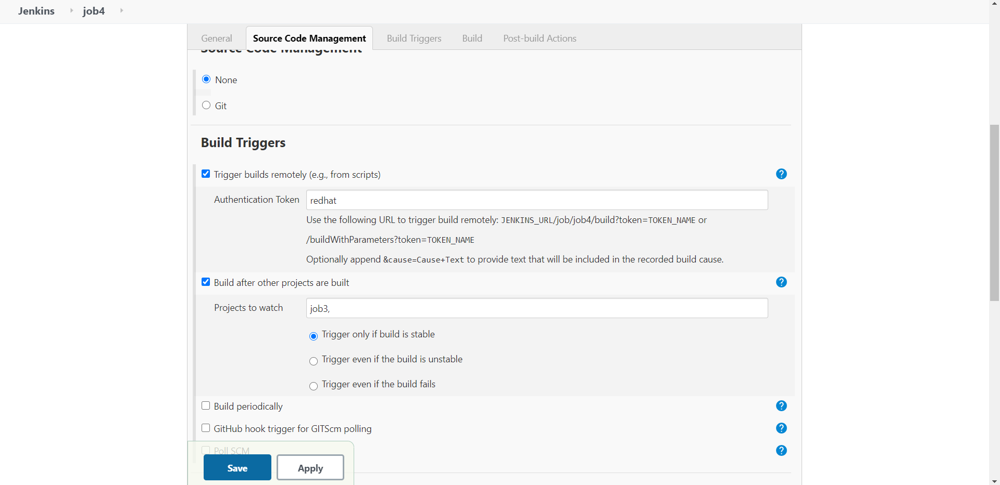
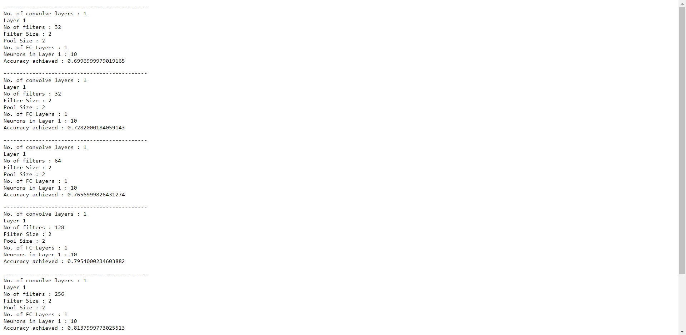
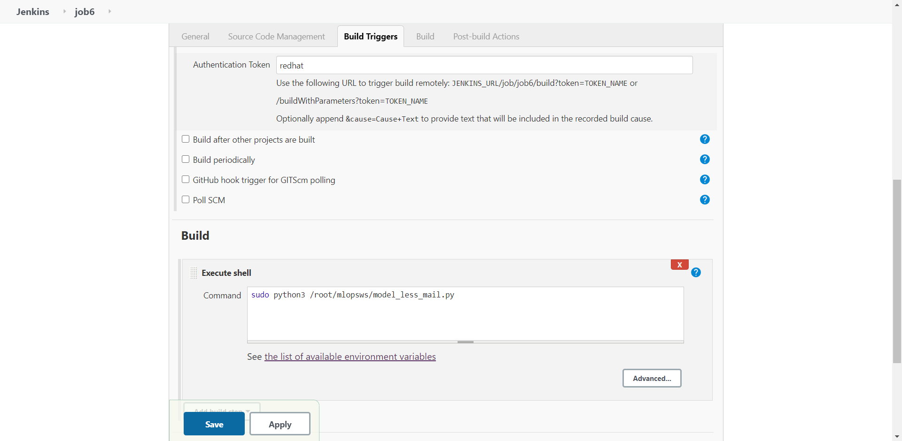
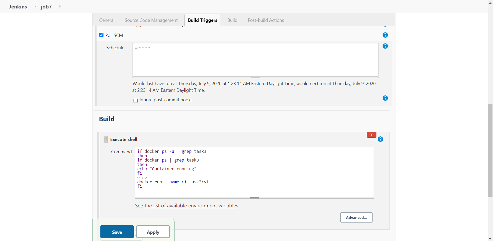

# AUTOMATION OF DEEP LEARNING MODEL WITH JENKINS

TOOLS USED : 

1. Git and Github- for version control and hosting our repository
2. Jenkins- to automate various jobs
3. Rhel8- as a base os for running services like httpd, jenkins,ngrok
4. Docker- to run our python model

## Step 1 : Setting our local git repository
Configure a post-commit script which will automatically push my code whenever we commit any new change.
- To do this you have to go to your code folder where you have set your .git
- then using [$cd /.git/hooks ] go to the hooks directory
- then using [$cat > post-commit] create a script that will push your code when you commit
- in post-commit write what’s in the image below and press ctrl+d to save it.
- then goto your main code folder and try to commit

## Step 2 : Setting Tunnel for private ip in Rhel
Github is on Public World and Github needs access to our private ip on which Jenkins is running.
For this we use Tunnel concept through ngrok. We set up ngrok software for the port and protocol Jenkins is running. In my case Jenkins is running on port 8080 and using http protocol. Use the command :

*./ngrok http 8080*

We will use this ip provided by ngrok in setting up our web-hooks in Github repo.

## Step 3 : Setting Web-hooks in Github Repo
We need web-hooks for our Jenkis JOB,  which will detect any change in the Github repo and send it to our Rehl Os at the specified location. 

To set Web-hooks, go to our git hub repository and then

->Settings ->in Options ->Webhooks ->Add Webhook ->Enter your password ->In payload url enter [ngrok_ip/github-webhook/] ->Change Content type to [application/json] ->then Save the Webhook

## Step 4 : Create JOB1 in Jenkins
JOB1 will automatically pull the Github repo to a specified directory in our Rhel Os whenever developer pushes any new code.

## Step 5 : Creating Our Own Docker Image
To run our ML code in Docker container we have to create our own Docker Image with Centos as the base and all the required libraries and python36 installed within it.

To create Docker image, we need to make a Dockerfile with the following code

After saving the Dockerfile , run the following command to create image :

*#docker build -t task3:v1 /root/mlopsw*

## Step 6 :  Creating JOB2 in Jenkins
By looking at the ML code or program file, this job will automatically start the respective machine learning software installed, Interpreter installed image container to deploy code and start training( eg. If code uses CNN, then Jenkins should start the container that has already installed all the softwares required for the CNN processing) i.e Run Docker Container from the Docker Image created in *Step 5*.

This is the console output

## Step 7 : Creating JOB3 in Jenkins
JOB3 has a task to copy the [show_output.html] file from Parent Directory to /var/www/html which is the default directory for webpages in Apache Webserver.
This [show_output.html] file will show us The hyperparameters used and the Accuracy of our model.

Before going in Jenkins run following command to start httpd server in rhel

*#systemctl start httpd*  

In Job 2 configuration , Set Build Triggers to ->Build after other Projects are build->put JOB2 in it.

## Step 8 : Creating JOB4 in Jenkins
JOB4 will monitor the accuracy of Model and if the accuracy of model is less then required accuracy then It will launch the *tweaker.py* program which will add extra Convolution Layers and Run JOB2 again to train model and JOB6 to send Email to the Developer “That accuracy is low, Running the Tweaker program”.
And if the Model Acheived required accuracy JOB5 will run as JOB4 will get terminated by [exit 0] command.

Write the following code in Execute shell space :

if [[ "$(sudo cat /root/mlopsws/show_accuracy.txt)" < "0.987" ]]

then

echo "Twerking the model"

sudo python3 /root/mlopsws

sudo curl --user "admin:jenkins_password" http://IP_of_jenkins:8080/job/job6/build?token=redhat

sudo curl --user "admin:jenkins_password" http://IP_of_jenkins:8080/job/job2/build?token=redhat

exit 1

else 

exit 0

fi

As JOB4 will run again and again until desired accuracy is acheived, Our *show_display.html* file will also get changed by JOB3 and will show different accuracies and hyperparameters from each run of JOB2 model.

## Step 9 : Creating JOB5 in Jenkins
After getting the desired accuracy from JOB2 model, JOB4 will get terminated and JOB5 will run. This job will run *success_mail.py* and send the notification of PROJECT COMPLETION to the developer.

Python file to send email is in repo.Edit this code in Rhel and put your own Credentials.

## Step 10 : Creating JOB6 in Jenkins
When model does not acheive the desired accuracy, Then JOB4 will run JOB2 and JOB6. JOB6 will send the message of unsuccess and running the tweaking code by running *model_less_mail.py*

## Step 11 : Creating JOB7 in Jenkins
JOB7 will run Every Hour and check If Container where model is running or not. If it Fails due to any reason then this job will automatically start the container again from where the last trained model left

We will Configure Poll SCM schedule for one hour

## This is all in this project
## THANKYOU
For any queries : email - manan1214@gmail.com

